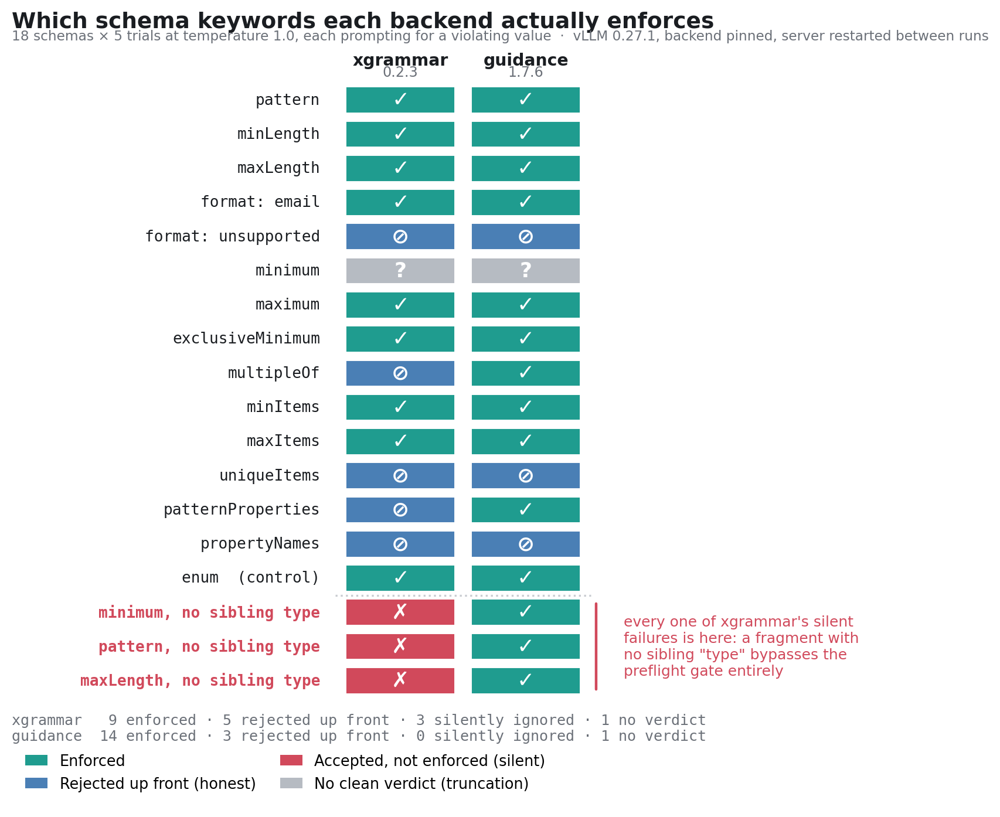
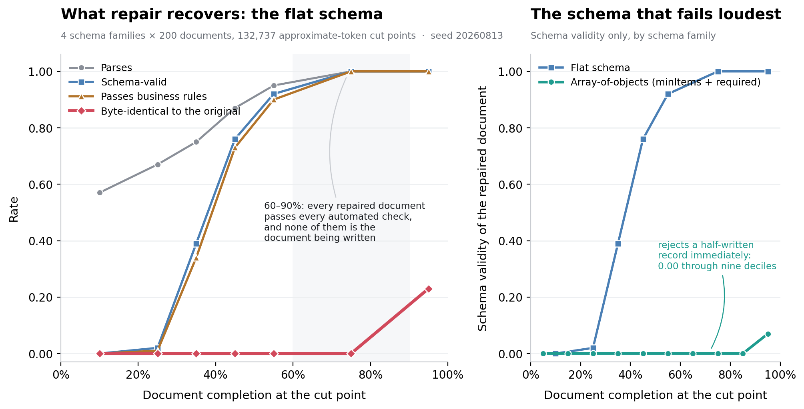
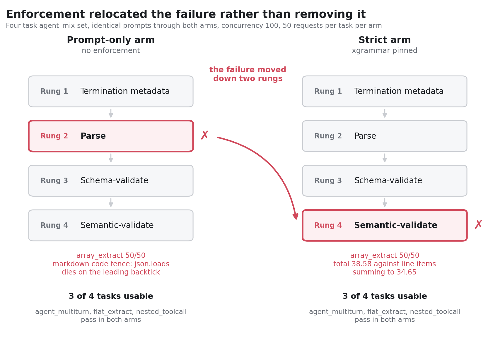
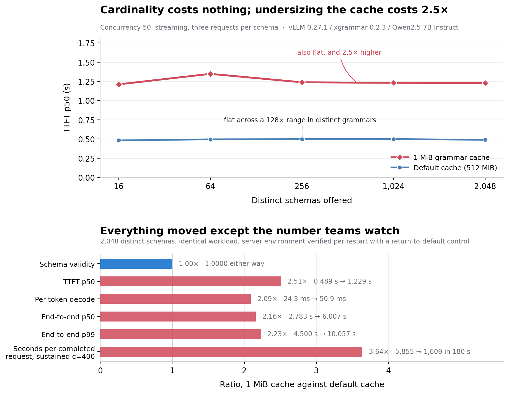
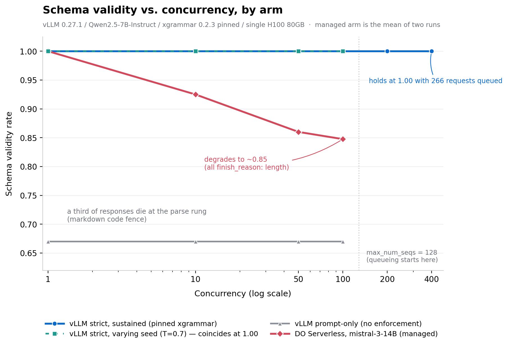
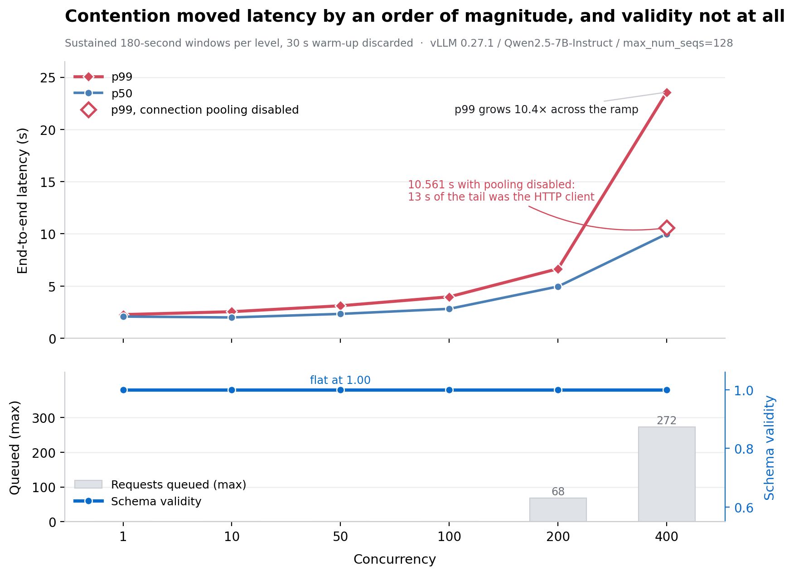

# Structured Output Reliability at Scale: When JSON Schema Validity Breaks Down Under Concurrency

**A reproducible measurement of what constrained decoding actually guarantees, where "strict" quietly isn't, and which of the five structured-output failure modes concurrency is responsible for.**

- **Self-hosted arm:** vLLM `0.27.1` with `xgrammar 0.2.3` explicitly pinned, on a single H100 80GB GPU Droplet, `max_num_seqs=128`, `--enforce-eager`
- **Managed arm:** DigitalOcean Serverless Inference, `mistral-3-14B`, strict `json_schema` mode
- **Models:** `Qwen/Qwen2.5-7B-Instruct` (self-hosted); `mistral-3-14B` (managed)
- **Volume:** 28,246 requests in the sustained strict ramp alone, concurrency 1 → 400; 132,737 synthetic truncation cut points; 18 schema keywords × 5 trials × 2 grammar backends; a 64 → 2,048 distinct-grammar cardinality ladder
- **Everything in this repository is what actually ran:** the ramp harness, the truncation and cost models, the stage driver, the summarizer, and the plotting code that produced every figure in the article.

This repository is the evidence base for a companion article, *"Structured Output Reliability at Scale: When JSON Schema Validity Breaks Down Under Concurrency"* (DigitalOcean Community, forthcoming).

---

## Abstract

Structured-output guidance fixates on whether the model returns valid JSON. This study measures the whole path and finds that the check most teams run is the one that catches least.

Constrained decoding guarantees a *prefix* invariant: after every token, the string so far is a valid prefix of some document matching the grammar. That is a strong guarantee about structure and it says nothing about whether generation terminates, whether the values are right, whether your backend enforces the keyword you wrote, or which backend is serving you at all. Five failure modes follow from that gap (truncation, constraint-boundary, semantic, extraction/parser, and contention), and this repository measures all five on real infrastructure. Transport failures are broken out as a sixth bucket outside the taxonomy, because they produce no document to classify.

The headline result is that **concurrency, the thing the folklore blames, splits by where you run it**. On version-pinned self-hosted vLLM, strict-mode schema validity held at 1.00 on every response returned, from concurrency 1 to 400 under sustained load, with 270 requests queued behind a 128-slot batch and p50 latency near ten seconds. The same schemas and prompts against a managed endpoint slid from 1.00 to roughly 0.85 as concurrency climbed. Contention moved p99 by roughly fivefold on the pinned stack and validity not at all.

The only structural-validity misses were dropped HTTP connections from the measurement client's own pool. Disabling connection reuse at concurrency 400 removed them while the queue stayed deep. That is the exact misattribution the taxonomy exists to prevent, occurring inside the study's own instrumentation.

---

## Key findings

### 1. The first structured-output request elects the grammar backend for the life of the process

vLLM's default `auto` backend resolves per request, but the engine only *reads* the resolved value when `self.backend is None`. Every later request computes its own and discards it. If the first structured-output request your server ever sees was a health check carrying a `patternProperties` schema, the whole fleet is running `outlines`. Nothing is logged; the fallback is a `try`/`except ValueError` that swallows the exception.

This is a startup-order dependency, which is how the same schema enforces differently in staging and production with identical engine versions and identical flags. On the serving host used here, all four backends were installed and importable, and two of them (`outlines`, `lm-format-enforcer 0.11.3`) returned HTTP 500 on every request for reasons unconnected to any schema under test.

**Pin `--structured-outputs-config.backend` explicitly. It costs one flag.**

### 2. xgrammar silently ignores constraints that carry no sibling `"type"`

Every branch of vLLM's xgrammar preflight check tests `obj.get("type") == ...` before examining the keyword, so a fragment like `{"minimum": 100}` bypasses the gate and reaches a compiler whose handling is also type-driven.

Across 18 keywords × 5 trials, silent under-enforcement appeared exactly three times, and all three were untyped fragments on xgrammar. Guidance had none.

| | Enforced | Rejected up front | **Accepted but ignored** | No clean verdict |
|---|---|---|---|---|
| **xgrammar** | 9 / 18 | 5 | **3** | 1 |
| **guidance** | 14 / 18 | 3 | **0** | 1 |



For *typed* keywords the rejection list is an honest interface on both backends: everything accepted was enforced, everything unsupported was refused with an error. Draft 2020-12 schemas omit `type` routinely, and so does anything converted loosely from TypeScript types or Python dataclasses.

### 3. Repair recovers well-formedness far more readily than content

Cutting 200 generated documents per schema family at every approximate token boundary and running each cut through a repair heuristic, then asking four separate questions rather than one:

| Completion | Parses | Schema-valid | Business rules | Byte-identical |
|------------|--------|--------------|----------------|----------------|
| 0–20% | 0.57 | 0.00 | 0.00 | 0.00 |
| 40–50% | 0.87 | 0.76 | 0.73 | 0.00 |
| **60–90%** | **1.00** | **1.00** | **1.00** | **0.00** |
| 90–100% | 1.00 | 1.00 | 1.00 | 0.23 |



Past about 60% completion every automated check says yes and not one document is the one the model was writing. Array-of-objects is the instructive exception: `minItems` plus required per-record fields hold schema validity at 0.00 through nine deciles. The schema that fails loudest protects you best.

### 4. Enforcement can relocate a failure rather than remove it

Four tasks, identical prompts, both arms, 50 requests per task per arm:

| Task | Strict arm | Prompt-only arm |
|------|-----------|-----------------|
| `agent_multiturn` | ok 50/50 | ok 50/50 |
| `flat_extract` | ok 50/50 | ok 50/50 |
| `nested_toolcall` | ok 50/50 | ok 50/50 |
| `array_extract` | **semantic** 50/50 | **extraction_parser** 50/50 |



Without enforcement the invoice task wraps its answer in a markdown fence and `json.loads` dies on the leading backtick. With enforcement the fence is unsamplable, the document parses and validates, and the same task fails at business rules on the arithmetic instead. The failure moved from the rung that stops a pipeline loudly to the rung most teams never build.

### 5. An undersized grammar-compiler cache costs 2.5× the latency with validity untouched

Restarting with `VLLM_XGRAMMAR_CACHE_MB=1`, verified in the process environment rather than inferred from the launch flag, and changing nothing else:

| | TTFT p50 | e2e p50 | e2e p99 | Per-token decode | Schema valid |
|---|---|---|---|---|---|
| **Default cache** | 0.489 s | 2.783 s | 4.500 s | 24.4 ms | **1.0000** |
| **1 MiB cache** | 1.229 s | 6.007 s | 10.057 s | 50.7 ms | **1.0000** |



Under sustained load at concurrency 400 the reduced cache completed 1,609 requests where the default completed 5,855, a 3.6-fold throughput collapse, with every output schema-valid and semantically correct throughout. The threshold is bytes against working set rather than a schema count: three schemas at 1 MiB showed no penalty, sixteen paid the full 2.5×.

Every rung of the validation ladder reports success while this is happening. The symptom that does show up, slow generation, is the one people attribute to the model or the GPU.

### 6. On a pinned stack, concurrency moves p99 by roughly fivefold and validity not at all



| Concurrency | Requests | Schema valid | Truncation | Queued (max) | Preemptions | p50 (s) | p99 (s) |
|---|---|---|---|---|---|---|---|
| 1 | 104 | **1.00** | 0.00 | 0 | 0 | 2.080 | 2.232 |
| 100 | 6,837 | 0.9994 | 0.00 | 0 | 0 | 2.830 | 3.884 |
| 200 | 7,939 | 0.9984 | 0.00 | **72** | 0 | 4.881 | 7.404 |
| 400 | 8,124 | 0.9991 | 0.00 | **270** | 0 | 9.386 | 11.279 |

Every sub-1.00 entry is a dropped HTTP connection rather than a schema failure. Re-running concurrency 400 with connection reuse disabled and nothing else changed:

| | Requests | Schema valid | Transport failures | Queued (max) | p50 (s) | p99 (s) |
|---|---|---|---|---|---|---|
| Pooled connections | 8,124 | 0.9991 | 7 | 270 | 9.386 | 11.279 |
| **Pooling disabled** | 8,181 | **1.0000** | **0** | 266 | 9.410 | **10.561** |



The queue is still 266 deep against 270 in the pooled run, so this is the same contention with the client's pool out of the path. **Strict-mode validity at concurrency 400 under sustained load, with a real queue, is 1.00 with no asterisk.** Before concluding that load broke your constrained decoding, check your client.

### 7. Enforcement is close to free on an idle server and costs about a third of per-token time under load

Per-token decode computed as (end-to-end − TTFT) ÷ completion tokens, six repeats per cell:

| Concurrency | Prompt-only | Strict | Enforcement cost |
|---|---|---|---|
| 1 | 9.71 ms | 10.04 ms | +0.3 ms (+3%) |
| 10 | 9.96 ms | 11.23 ms | +1.3 ms (+13%) |
| 50 | 11.23 ms | 13.86 ms | +2.6 ms (+23%) |
| 100 | 12.44 ms | 16.11 ms | +3.7 ms (+29%) |

Read it as an end-to-end operator cost rather than kernel time: per-token decode under batching includes inter-token waiting, so part of the gap is strict requests occupying the batch longer. Separating mask computation from the scheduling it competes with still needs a profiler inside the sampling loop.

---

## Methodology

**Fixed variables**

- One H100 80GB GPU Droplet serving vLLM; a separate client host running the harness, with `pip freeze` captured on both
- Grammar backend **pinned explicitly**, never left on `auto`, and the *resolved* backend recorded rather than the requested one
- `max_num_seqs=128`, `max_completion_tokens=512` except where stated, temperature 0.0 with seed 20260813 except where stated
- Warm-up discarded on every ramp; 30 seconds of each 180-second sustained window
- `--enforce-eager`, plus a one-line local patch to `flashinfer-python`'s `comm/fd_exchange.py` removing an invalid `array.array[int]` subscript. Both were required to get the server up and neither affects runtime behaviour.

**Why `max_num_seqs` is load-bearing rather than a tuning knob**

It is the batch capacity, and offered concurrency below it *cannot queue*. The first version of this ramp stopped at concurrency 100 against a 128-slot batch, so every request it ever offered fit inside a single batch: nothing queued, nothing was preempted, and KV-cache occupancy peaked at 0.97%. "Concurrency did not change validity" was a true statement about a server that was never contended. Scheduler queueing was impossible by construction, not absent by observation.

Every concurrency level in this repository is checked against `max_num_seqs` before its result is read. The summarizer flags any level where nothing queued as *untested* rather than passing.

**The two axes**

1. **Request count.** Concurrency 1 → 10 → 50 → 100 as fixed-count bursts, then 1 → 400 as sustained 180-second windows that cross the batch capacity.
2. **Distinct grammars.** 64 → 2,048 structurally distinct schemas against both the default compiler cache and a 1 MiB one, because request count cannot reach compilation and cardinality can.

**What each request records**

Schema validity, semantic validity against ground truth, truncation by termination metadata, one normalized taxonomy category and subcategory, end-to-end p50/p95/p99, client-side TTFT when streaming, measured cost per usable output from real token counts, and server-side contention signals scraped from vLLM's `/metrics` across the measured window (queue depth, KV-cache occupancy, preemption count) reported as counter deltas over the window rather than process-lifetime values.

**Controls that decide whether a run means anything**

| Control                                       | What it rules out                                        |
|-----------------------------------------------|----------------------------------------------------------|
| Pooling-disabled re-run at concurrency 400    | Whether transport drops were the server or the client    |
| Return-to-default cache restart               | Whether the cache penalty was the setting or the restart |
| Three-schema working set at 1 MiB             | Whether a 1 MiB server is simply broken                  |
| Varying-seed arm (temp 0.7, `--seed -1`)      | Whether rates are determinism artifacts                  |
| Typed twin for every untyped conformance case | Whether the type gate is the keyword or the sibling      |
| Prompt-only arm on identical prompts          | Whether enforcement removed a failure or moved it        |

---

## Repository layout

```bash
harness/          Measurement code. Everything that talks to a server.
  validity_ramp_harness_v4.py   The current concurrency harness and source of the instrumented ramps.
  validity_ramp_harness_managed.py  Kept because the published managed-endpoint arm ran on it.
  validity_ramp_harness_burst.py    Kept because the published burst ramp ran on it.
  backend_conformance_probe.py  The 18-keyword enforcement probe, one backend per run.
  run_conformance.sh            Drives the probe across backends.
  truncation_experiment.py      Cut-point recoverability + validation-ladder benchmark. Offline.
  cost_of_failure.py            Modelled cost-per-valid-output arithmetic. Offline.
  run_gap_closure.sh            Stage driver. Runs every arm the article reports, in order.
analysis/         Turns result files into tables and figures.
  summarize_runs.py             Result JSONs -> the article's tables + a contention verdict.
  compare_conformance.py        Probe output -> the keyword-enforcement grid.
  plot_figures.py               All six article figures. Takes no input files.
figures/          The six figures, as published.
results/          Every published run, including per-request records. See its README.
```

Each directory has its own README with per-script detail, flags, and the cautions specific to it.

---

## Reproducing

### Offline, no GPU and no account (about ten seconds)

Two of the measurements need no server at all, and they cover the truncation and cost tables in full.

```bash
python3 -m venv .venv && source .venv/bin/activate
pip install -r requirements.txt

python3 harness/truncation_experiment.py    # cut-point recoverability + ladder timings
python3 harness/cost_of_failure.py          # modelled cost per valid output
python3 analysis/plot_figures.py            # re-render all six figures into figures/
```

`truncation_experiment.py` finishes in about six seconds and its correctness rates are version-independent: they reproduced identically to four decimal places across `jsonschema` 4.26.0 / Python 3.12.3 and `jsonschema` 3.2.0 / Python 3.10.12 on different hardware. **The ladder timings are not version-independent and should not be quoted without a stamp.** On the article's environment schema validation cost 60.6–297.3 µs per document; on Python 3.9.6 / jsonschema 4.25.1 the same script reports 15.9–98.6 µs. Report yours with your versions.

### Against a live server

Bring up vLLM with the backend **pinned**, since `auto` latches on the first structured-output request and a ramp run against `auto` cannot say which backend produced its numbers:

```bash
vllm serve Qwen/Qwen2.5-7B-Instruct \
  --structured-outputs-config.backend xgrammar \
  --max-num-seqs 128 --enforce-eager
```

Then, on the client host:

```bash
ulimit -n 8192          # 400 concurrent connections exceeds the common 1024 default
export BASE_URL=http://SERVER:8000/v1 API_KEY=EMPTY
export METRICS=http://SERVER:8000/metrics

STAGES=all bash harness/run_gap_closure.sh
python3 analysis/summarize_runs.py results
```

`STAGES` selects arms so a single one can be re-run without redoing an hour of finished work:

| `STAGES=` | Arm |
|---|---|
| `1` | Sustained load past batch capacity, strict / prompt-only / long-generation |
| `2` | TTFT streaming pass, both arms |
| `3` | Two-turn agent task and the matched `agent_mix` relocation run |
| `4` | Tight budget, edge schemas, varying seed |
| `5` | Managed endpoint (needs `DO_BASE_URL`, `DO_API_KEY`) |
| `6` | Five-step agent conversation, both arms |
| `7` | Schema-cardinality ladder, default cache |
| `8` | Schema-cardinality ladder, **undersized cache**. Excluded from `all` on purpose |
| `all` | Everything except stage 8 |

**Stage 8 needs a differently configured server** and would silently invalidate anything run alongside it. Restart with the reduced cache, verify it in the process environment rather than trusting the launch command, run stage 8 alone, then restart at the default and repeat one rung as a control:

```bash
VLLM_XGRAMMAR_CACHE_MB=1 vllm serve Qwen/Qwen2.5-7B-Instruct \
  --structured-outputs-config.backend xgrammar --max-num-seqs 128 --enforce-eager

# Run this verification on the Linux serving host.
tr '\0' '\n' < /proc/$(pgrep -f '[v]llm serve' | head -1)/environ | grep XGRAMMAR

# On the client host:
XGRAMMAR_CACHE_MB=1 STAGES=8 OUT=results/cardinality/cache-1mib \
  bash harness/run_gap_closure.sh
```

An exported variable left over from a previous shell is exactly how a run ends up mislabelled. Without the return-to-default control, the restart is an alternative explanation for everything the reduced-cache arm shows.

### The backend-conformance grid

Findings 1 and 2 come from a separate probe, not from the ramp, because the backend is a server-level setting and each one needs its own server:

```bash
MODEL=Qwen/Qwen2.5-7B-Instruct bash harness/run_conformance.sh
python3 analysis/compare_conformance.py results/conformance/conformance_{xgrammar,guidance}.json
```

That reproduces the published 18-keyword grid exactly. Pass all four probe files instead and the comparison refuses to print, on purpose: `outlines` and `lm-format-enforcer` returned HTTP 500 on every request on this install, and a backend that fails the `enum` control isn't measuring the other keywords either. See `harness/README.md` for the manual path, which is more reliable than letting a script manage servers.

If you'd rather not hand-install vLLM, DigitalOcean's [vLLM 1-Click Model](https://docs.digitalocean.com/products/marketplace/catalog/vllm/) deploys it on a GPU Droplet with no additional setup. You still need to pin the structured-output backend yourself once it's up.

---

## Limitations of the study itself

- **Preemption never fired anywhere:** not at concurrency 400, not at a raised token budget, not with 355 requests queued against a thrashing grammar cache. The one contention mechanism with a plausible route into constrained-decode state is untested rather than cleared. Reaching it needs prompts that emit thousands of tokens.
- **Most rates are deterministic paths repeated, not independent draws.** Temperature 0 with a fixed seed means 200 requests per level are 200 repetitions of three completions. The varying-seed arm is what addresses this, and it agreed.
- **The grammar cache is measured in effect but not in cause.** A 2,048-schema ladder showed no penalty at 16 MiB where the 1 MiB result predicts one. That run predates the per-restart environment verification and is reported rather than relied on, but it isn't reconciled.
- **The two serving arms differ in model as well as stack** (Qwen2.5-7B against mistral-3-14B), so they are two data points on enforcement consistency rather than a controlled isolation of the serving layer.
- **The sustained reduced-cache arm under-rotated.** Its rotation reaches a fresh schema per request, so 1,609 completions touched 1,609 of the 2,048 schemas offered. The throughput collapse stands; the cardinality on that row is 1,609.
- **SGLang was never run.** Everything said about a second engine is sourced from code-reading.
- **Only one host, one GPU, one model per arm.** If your results differ from anything reported here, that difference is the finding.

---

## Citation

> Structured Output Reliability at Scale: When JSON Schema Validity Breaks Down Under Concurrency (2026). https://github.com/mkurup27/structured-output-reliability-at-scale

## License

MIT. See [LICENSE](LICENSE).
